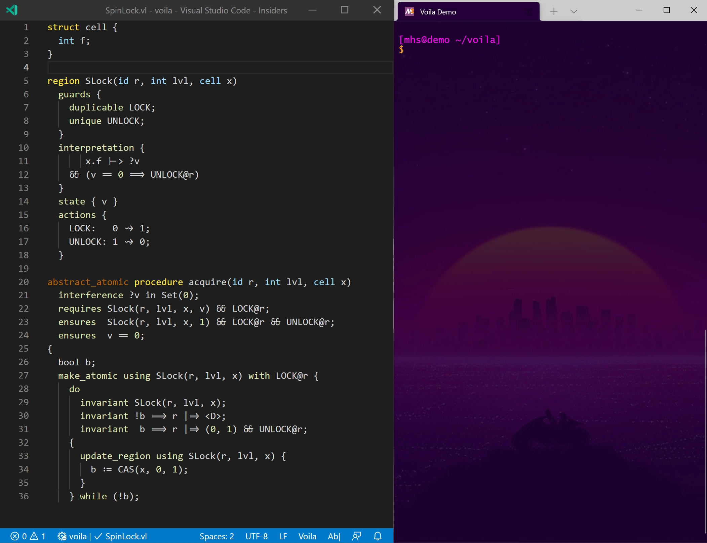

# Voila: Concise Outlines for a Complex Logic

   

Voila — paper to appear at [FM'21](https://lcs.ios.ac.cn/fm2021/), see [arXiv.org](https://arxiv.org/abs/2010.07080) for now — is a *proof outline checker* for fine-grained concurrency verification. It supports a simple, Java-like programming language, with specifications based on a concurrent separation logic. Voila uses the [Viper verification infrastructure](https://viper.ethz.ch) to automatically discharge all proof obligations.

See [TicketLock.vl](https://github.com/viperproject/voila/blob/master/src/test/resources/examples/Caper/TicketLock.vl) for an example, or browse all examples and regression tests in [src/test/resources](https://github.com/viperproject/voila/blob/master/src/test/resources).

## Installation

Prerequisites:

1. Java: Voila is written in Scala, and runs on the Java Virtual Machine. We recommend Java 11, but newer versions should work as well.

1. Z3: Voila uses the excellent Z3 SMT solver. We strongly recommend [Z3 4.8.7](https://github.com/Z3Prover/z3/releases/tag/z3-4.8.7). Add Z3's executable to your path, or let environment variable `Z3_EXE` point to it.

We provide instructions for Linux, but adapting them for Windows or MacOS should be straightforward.

### Pre-built

Download the [latest official Voila release](https://github.com/viperproject/voila/releases/latest), or see [all Voila release](https://github.com/viperproject/voila/releases) for alternatives.

### Self-built

Install the Scala build tool [sbt](https://www.scala-sbt.org/download.html), version 1.4.4 or newer.

1. Download this repository into, e.g. `~/voila`
1. Download [Silver](https://github.com/viperproject/silver/) into `~/voila/silver`
1. Download [Silicon](https://github.com/viperproject/silicon/) into `~/voila/silicon`
1. Open a terminal, change directory to `~/voila`, and start `sbt`
   1. Compile with sbt command `compile`
   1. Generate fat jar `~/voila/target/scala-2.13/voila.jar` with sbt command `assembly`
   1. Optional: verify a single file with `run`, e.g. `run src/test/resources/examples/Caper/TicketLock.vl` (no verification failures expected)
   1. Optional: run all tests with sbt command `test` (will take some time)
   1. Quit with sbt command `exit`

## Usage

1. Open a terminal, change directory to where you downloaded or built Voila, e.g. `~/voila`
1. Run `./voila.sh -i <path_to_file.vl>` to verify a file

## Demo Session

   

## Authors

Voila is developed at ETH Zurich, by 
[Felix A. Wolf](https://www.pm.inf.ethz.ch/people/person-detail.html?persid=198607), 
[Malte Schwerhoff](https://www.pm.inf.ethz.ch/people/person-detail.html?persid=162169), and 
[Peter Müller](https://www.pm.inf.ethz.ch/people/person-detail.html?persid=112017).

## License

Voila is licensed under [Mozilla Public License Version 2.0](LICENSE.txt).
